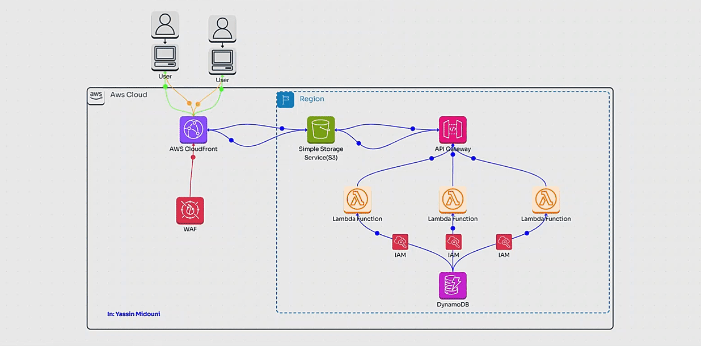
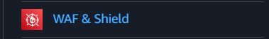
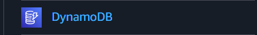
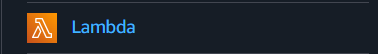
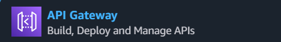

### Build a Serverless App with AWS Lambda, S3, DynamoDB, and Python 🖥️☁️🐍

---

## 🌟 **Introduction**

Serverless architecture 🌐 has transformed the way we develop and deploy web applications. By removing the need to manage servers and scaling infrastructure, developers can focus on writing quality code and delivering value. 

In this guide, we’ll explore how to build a **serverless web application** using these AWS services:  
- **S3** for hosting 📂  
- **Lambda** for compute functions 🛠️  
- **DynamoDB** for database storage 📊  
- **API Gateway** for RESTful APIs 🌐  
- **CloudFront** for content delivery 🚀  
- **AWS WAF** for web security 🔒  

Together, we’ll walk through the setup, best practices, and benefits of creating your own serverless app using AWS services. 💻

---

## 🏗️ **Solution Architecture**

### What is Serverless? 🤔  
Serverless architecture is a **cloud computing paradigm** that eliminates the need for managing physical servers. 🛠️  
Instead:  
- Developers write **stateless functions** 📝  
- Functions are triggered by **events** 🔔  
- Scaling happens automatically based on demand 📈  

**Key Benefits:**  
✔️ Cost efficiency  
✔️ Scalability  
✔️ Reduced operational overhead  
✔️ Faster development  

### Architecture Overview 🌐  
The solution relies on AWS services working seamlessly together. Here’s what we use:  

#### **Amazon S3** 📂  
A highly scalable storage solution for hosting files like HTML, CSS, JavaScript, and media assets.  

#### **AWS Lambda** 🛠️  
Run your Python code without worrying about provisioning servers. Perfect for event-driven tasks!  

#### **DynamoDB** 📊  
A fully managed NoSQL database providing low-latency, high-availability storage.  

#### **API Gateway** 🌐  
Build, publish, and manage secure REST APIs to expose application functionality.  

#### **CloudFront** 🚀  
AWS's CDN ensures your content is delivered quickly and reliably across the globe.  

#### **AWS WAF** 🔒  
A web application firewall to secure against common exploits like SQL injections.

---

## ✅ **Prerequisites**

Before starting, ensure you have:  
1️⃣ **AWS Account**: Sign up for an account to access AWS services.  
2️⃣ **IAM Knowledge**: Understand roles and permissions in AWS.  
3️⃣ **AWS Lambda Basics**: Familiarity with writing functions.  
4️⃣ **Python Skills** 🐍: Ability to write basic Python scripts.  
5️⃣ **REST API Knowledge**: Understand HTTP methods like `GET`, `POST`, and `DELETE`.

---

## 🛠️ **Step-by-Step Guide**

### 1. **Configure AWS S3, CloudFront, and WAF**  

#### 📂 **Set Up S3 Bucket** 

1. Log in to the **AWS Console** > Navigate to **S3** > Click **Create bucket**.  
2. Provide a **unique bucket name** and choose a region 🌍.  
3. Upload your web application files by selecting the bucket and using the **Upload** option.  

#### 🔒 **Set Up AWS WAF**  

1. Navigate to **AWS WAF** > Click **Create web ACL**.  
2. Add **Managed Rule Groups** to secure your app against attacks.  
3. Apply the rules to your **CloudFront distribution**.

#### 🚀 **Set Up CloudFront CDN** 

1. Go to **CloudFront** > Click **Create Distribution**.  
2. Choose your S3 bucket as the origin.  
3. Configure **Viewer Protocol Policy** and **Web ACL** settings.  
4. Deploy the distribution and link it to your S3 bucket.

---

### 2. **Configure DynamoDB and Lambda Functions**  

#### 📊 **Create a DynamoDB Table**  
1. Navigate to **DynamoDB** > Click **Create table**.  
2. Name the table and specify a partition key.  

#### 🔑 **Set Up IAM Roles**  

1. Go to **IAM Service** > Create a role for Lambda.  
2. Attach the **AmazonDynamoDBFullAccess** policy. *(For production, follow the least privilege principle.)*

#### 🛠️ **Create Lambda Functions** 

1. Go to **AWS Lambda** > Click **Create function**.  
2. Write functions in Python for:  
   - `insertEmployee` 📝  
   - `getEmployees` 🧾  
   - `deleteEmployee` 🗑️  
3. Deploy your code for each function.  

---

### 3. **Implement API Gateway** 

1. Navigate to **API Gateway** > Select **REST API** > Click **Build**.  
2. Create methods for your API:  
   - **GET** for retrieving employees 🧾  
   - **POST** for adding employees 📝  
   - **DELETE** for removing employees 🗑️  
3. Deploy the API and configure **CORS** to enable cross-origin requests.  

---

### 🧪 **Testing Your Application**

1. Copy the **CloudFront URL** and open it in your browser 🌐.  
2. Test the full functionality of your app using the configured endpoints.  
3. Use tools like **Postman** to verify API requests and responses.  

---

## 🎉 **Conclusion**

In this guide, we:  
✅ Set up a **serverless web app** using AWS services.  
✅ Configured **S3**, **CloudFront**, and **WAF** for hosting and security.  
✅ Used **Lambda** and **DynamoDB** for serverless compute and storage.  
✅ Built and deployed a secure API with **API Gateway**.  

By leveraging AWS’s serverless architecture, you can build scalable, cost-efficient, and secure applications to deliver amazing user experiences. 🚀  

Start your journey into serverless development today! ☁️
